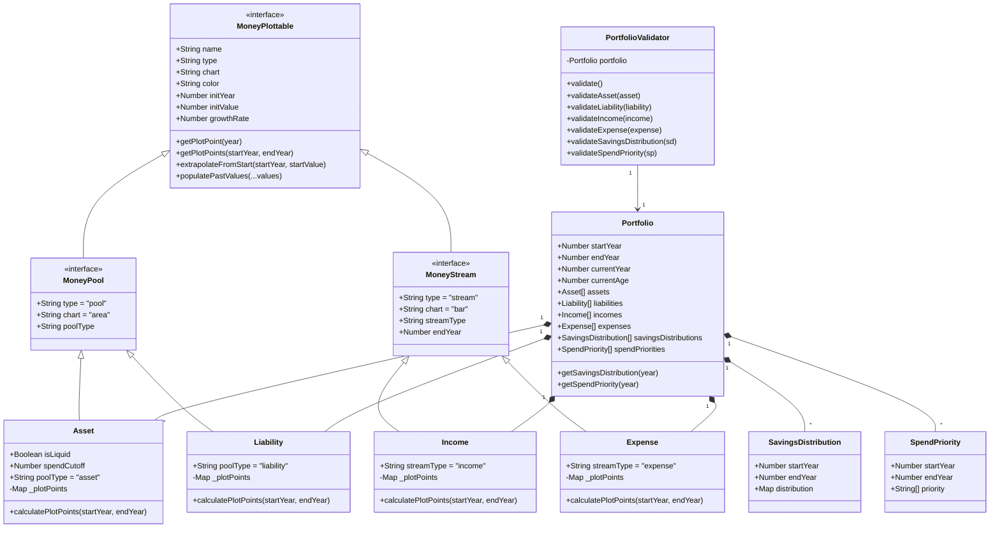

### TODO 

- [ ] If a goal buys something like a house, the house is an asset, but the money used to buy the house is a liability.
  - [ ] Generate assets from goals as well 
  - [ ] Differentiate between liquid and non-liquid assets

## Documentation 

### Class Diagram 

